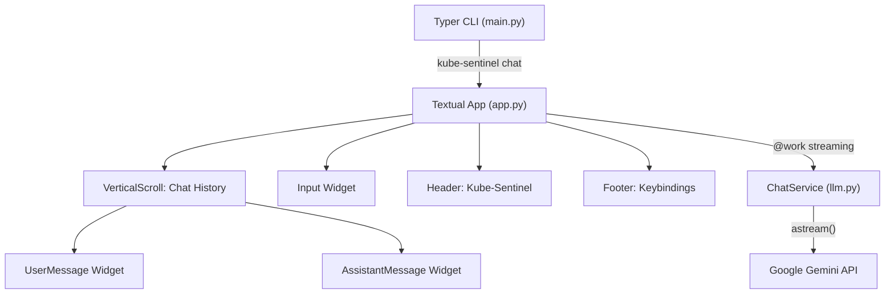

# Professional Terminal Chat Interface for Kube-Sentinel

## Architecture Overview




## Layout Design

```
+----------------------------------------------------------+
|  KUBE-SENTINEL                                   v0.1.0  |  <- Header
+----------------------------------------------------------+
|                                                          |
|  [assistant] Kube-Sentinel                               |
|  +------------------------------------------------------+|
|  | Hello! I'm Kube-Sentinel, your AI SRE assistant.     ||
|  | How can I help you today?                             ||
|  +------------------------------------------------------+|
|                                                          |
|  [user] You                                              |
|  +------------------------------------------------------+|
|  | Check the pods in default namespace                   ||
|  +------------------------------------------------------+|
|                                                          |
|  [assistant] Kube-Sentinel                               |
|  +------------------------------------------------------+|
|  | Checking the pods in the default namespace...         ||
|  | (streaming tokens appear here progressively)          ||
|  +------------------------------------------------------+|
|                                                          |
+----------------------------------------------------------+
|  > Type your message...                                  |  <- Input
+----------------------------------------------------------+
|  ctrl+c Quit  ctrl+l Clear  ctrl+n New Chat              |  <- Footer
+----------------------------------------------------------+
```

## New Dependency

- Add `textual` to `pyproject.toml` dependencies (Textual is built on top of Rich, which is already a dependency)

## File Structure (new/modified files)

```
src/kube_sentinel/
  cli/                        # NEW directory
    __init__.py               # NEW - empty
    main.py                   # NEW - Typer entry point
    app.py                    # NEW - Textual App class
    widgets.py                # NEW - ChatMessage widgets
    chat.tcss                 # NEW - Textual CSS stylesheet
  agent/
    llm.py                    # MODIFY - refactor into ChatService with streaming
```

## Implementation Details

### 1. Refactor `llm.py` into a ChatService

Transform the current script-style code in [src/kube_sentinel/agent/llm.py](src/kube_sentinel/agent/llm.py) into a `ChatService` class:

- Manage conversation history via `langchain_core.messages` (HumanMessage, AIMessage, SystemMessage)
- Expose an `async def stream(user_input: str) -> AsyncIterator[str]` method that yields tokens via `llm.astream()`
- Include a system prompt establishing the SRE assistant persona
- Provide `clear_history()` for resetting conversations
- Keep the `AgentResponse` model for future structured tool use (don't delete it)

### 2. Build the Textual App (`app.py`)

Create `KubeSentinelApp(App)`:

- `compose()` yields: `Header`, `VerticalScroll` (chat area), `Input` (user input), `Footer`
- `on_mount()` displays a welcome message from the assistant
- `on_input_submitted()` captures user text, adds a user message bubble, clears input, and triggers streaming
- `stream_response()` decorated with `@work(exclusive=True)` — iterates `ChatService.stream()`, progressively updating the assistant message widget via `call_from_thread` or direct async update
- Key bindings: `ctrl+c` quit, `ctrl+l` clear chat, `ctrl+n` new conversation

### 3. Custom Widgets (`widgets.py`)

- `ChatMessage(Static)` — a base chat bubble widget that renders content inside a Rich `Panel`
  - Constructor takes `content: str`, `role: str` ("user" or "assistant")
  - User messages: right-aligned label, blue/cyan border
  - Assistant messages: left-aligned label, green border, content rendered as Rich `Markdown` for code blocks/formatting
  - `update_content(text: str)` method for streaming updates (re-renders the panel)

### 4. Textual CSS (`chat.tcss`)

- Style the `VerticalScroll` chat area to fill available space
- Style `Input` to dock at the bottom
- Style message panels with appropriate padding, margins, and border colors
- Ensure the chat scrolls to bottom on new messages

### 5. Typer CLI Entry Point (`main.py`)

- Create a Typer app with a `chat` command that instantiates and runs `KubeSentinelApp`
- Add a `version` command showing the app version
- Register as a console script entry point in `pyproject.toml`: `kube-sentinel = "kube_sentinel.cli.main:app"`

### 6. Update `pyproject.toml`

- Add `textual` to dependencies
- Add `[project.scripts]` section with `kube-sentinel = "kube_sentinel.cli.main:app"` entry point

## Key Technical Decisions

- **Textual over textual-chat**: Building with raw Textual gives full control over the UI and future extensibility (tool call rendering, Kubernetes resource displays, etc.)
- `**@work` decorator**: Textual's worker system keeps the UI responsive while streaming tokens from the LLM
- **LangChain message history**: Using `ChatMessageHistory` for in-memory conversation state, easily swappable for persistent storage later
- **Markdown rendering**: Assistant responses rendered as Rich Markdown inside panels, giving proper code block formatting out of the box

